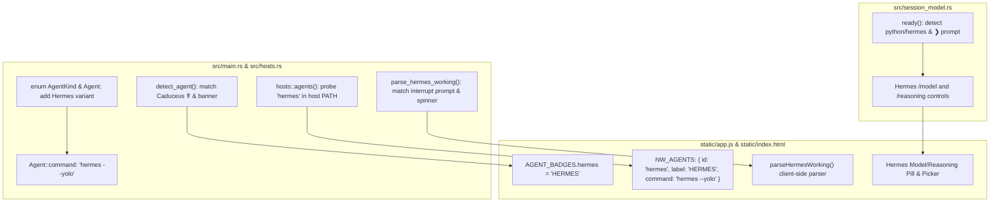

# Hermes Agent Integration Gameplan

Integration plan for adding **Hermes Agent** (`NousResearch/hermes-agent`) as a first-class optional CLI agent harness in `tmux-terminal`, alongside Claude, Codex, AGY, and Eunice.

## Implementation checkpoint — 2026-09-16

Core launch, discovery, badge, and Rust/JS working parsers are implemented.
The interrupted picker verification exposed differences in the installed
Hermes v0.21.3 UI (banner: upstream `4e9d3c71`): it has provider → model →
reasoning stages, profile-prefixed composers, and variable blank padding.
The integration now reads those native stages instead of supplying a separate
hardcoded effort control. Apply requires Hermes's model/effort confirmation;
an idle prompt alone is insufficient. Real provider/model/effort captures are
saved in `tests/fixtures/session_model/hermes_*.txt`.

The live browser test passed at desktop (1280px) and phone (390px) widths,
including provider/model selection, high/medium effort, Apply, Back, and Cancel.
Rust, JavaScript polling, Python multi-host, and Chromium regression tests pass.
WebKit cannot launch here because `libavif.so.16` is missing.

Verification used a private socket under `/tmp/tmux-hermes-verify.hrE2xh/`,
an isolated Hermes profile, and a test backend on port 15535 whose tmux wrapper
pins every operation to that socket and blocks shutdown commands. No tmux
server or session was stopped; the temporary HTTP backend was stopped afterward.
See `docs/session-model-picker.md` for the opt-in
browser check. Full busy/tool fixture collection and rollout checks below
remain separate from picker verification. The production web service was then
updated on 2026-09-16. `/api/agents` includes `hermes`; a phone-width browser
check confirms HERMES is visible/enabled and previews `hermes --yolo`.
Only the web service was restarted. Live tmux PID 549782, both sessions, and
all nine pane IDs/PIDs were unchanged. The previous deployment is backed up at
`/home/xeb/bin/tmux-terminal-deploy-backup.5WYFG9/`.

---

## 1. Overview & Context

### 1.1 What is Hermes Agent?
Hermes Agent is an autonomous, open-source AI agent harness built by Nous Research. It features multi-provider inference, tool execution (bash, files, browser, skills, subagents), memory persistence, and an interactive terminal interface (built on `prompt_toolkit` / Rich).

### 1.2 Current System Installation
- **Repository / Source:** `~/.hermes/hermes-agent` (version `v0.21.3`, commit `4fb7058`, Python 3.11 venv).
- **Executable Wrapper:** `~/.local/bin/hermes` (bash wrapper unsetting Python path overrides and executing `~/.hermes/hermes-agent/venv/bin/python`).
- **Configuration:** `~/.hermes/config.yaml`.
- **Workspace Tracking:** `~/p/hermes/AGENTS.md`.

### 1.3 Active Model & Blue Credential Architecture
- **Inference Provider:** OpenRouter (`openrouter`), endpoint `https://openrouter.ai/api/v1`.
- **Registered Model:** `z-ai/glm-5.3-flash` (`default: z-ai/glm-5.3-flash` in `~/.hermes/config.yaml`).
- **Credential Storage:** Blue TPM2 systemd credential encrypted to the host's TPM:
  `/home/xeb/.config/blue/credentials/openrouter-tmux-not-invented-here.cred`.
- **Credential Resolution:** Resolved dynamically into process memory at Hermes startup using the `secrets.command` helper in `~/.hermes/config.yaml`:
  ```yaml
  secrets:
    command:
      enabled: true
      command: 'printf "OPENROUTER_API_KEY=%s\n" "$(sudo systemd-creds decrypt --name=openrouter-tmux-not-invented-here.cred /home/xeb/.config/blue/credentials/openrouter-tmux-not-invented-here.cred -)"'
      helper_timeout_seconds: 5
      override_existing: true
  ```
  > [!IMPORTANT]
  > **Zero-Plaintext Policy:** Plaintext API keys are never written to disk, environment files, git, or command-line arguments. All launches must rely on Hermes's native config and secret provider.

---

## 2. Empirical Behavior & Terminal Signatures

We launched and analyzed live Hermes instances inside tmux to establish exact matching criteria.

### 2.1 Launch & Autonomy
- **Launch Command:** `hermes --yolo`
  - `--yolo` bypasses all dangerous command and tool confirmation prompts, matching Codex's `--yolo` and Claude/AGY's `--dangerously-skip-permissions`.
  - Does **not** require any directory trust prompt on first launch in a new directory (identical to Eunice).
  - Automatically recognizes and loads `AGENTS.md` from the current working directory.

### 2.2 Banner & Startup Screen
On startup, Hermes prints a boxed Rich header:
```text
╭─────────────────────────────────────────────────────────────────────────────╮
│  [ASCII art]   glm-5.3-flash · Nous Research                                │
│                ⚠ YOLO mode — all approval prompts bypassed                  │
│                /home/xeb/p/tmux                                             │
│                Session: 20260916_135915_4fb705                              │
│                25 tools · 54 skills · /help for commands                    │
╰─────────────────────────────────────────────────────────────────────────────╯

Welcome to Hermes Agent! Type your message or /help for commands.
```

### 2.3 Idle State (Awaiting User Input)
The bottom of the screen displays a two-line composer with a Caduceus status line:
```text
 ☤ glm-5.3-flash │ ctx -- │ [░░░░░░░░░░] -- │ 0s │ ⏲ 0s │ ⚠ YOLO
─────────────────────────────────────────────────────────────────────────────
❯ Ask anything, or type / for commands…
─────────────────────────────────────────────────────────────────────────────
```
When user input is entered, the placeholder disappears, leaving `❯ <text>`:
```text
 ☤ glm-5.3-flash │ ctx 1% │ [██░░░░░░░░] 2k/131k │ 2s │ ⏲ 4s │ ⚠ YOLO
─────────────────────────────────────────────────────────────────────────────
❯
─────────────────────────────────────────────────────────────────────────────
```

### 2.4 Busy State (Generating & Executing Tools)
While processing a turn, Hermes updates the prompt line into an interrupt notice and draws an animated spinner line with elapsed seconds:
```text
  ( •_•)>⌐■-■ mulling...                                                   ⏱ 4s
 ☤ ❯ msg=interrupt · /queue · /bg · /steer · Ctrl+C cancel
```
During tool execution, lines such as:
```text
  calling tool: file_read (path=...)
  calling tool: execute_code (language=bash, ...)
```
appear above the active prompt line.

### 2.5 Terminal Process Info (`#{pane_current_command}`)
In tmux, because `~/.local/bin/hermes` executes the Python binary directly via `exec`, `#{pane_current_command}` is `python` or `python3` (or `hermes` if invoked directly).

---

## 3. Integration Architecture

Integrating Hermes requires changes across backend Rust services, frontend vanilla JS/CSS, and test suites to achieve full parity with existing agents.



### 3.1 Host Probing & Discovery (`src/hosts.rs`)
In `pub async fn agents()`:
```rust
let out = command("bash")
    .args([
        "-ic",
        "for a in claude codex agy eunice hermes; do command -v \"$a\" >/dev/null 2>&1 && printf '__TMUX_AGENT__%s\\n' \"$a\"; done; true"
    ])
    .output().await;
```
If `hermes` is in `$PATH`, `GET /api/agents` returns `"hermes"` in the list of available agents. The UI automatically enables the `HERMES` option in the New Window modal.

### 3.2 Agent Identity & Types (`src/main.rs`)
1. **AgentKind Enum:**
   ```rust
   #[derive(Debug, Clone, Copy, PartialEq, Eq, Serialize)]
   #[serde(rename_all = "lowercase")]
   enum AgentKind {
       Claude,
       Codex,
       Agy,
       Eunice,
       Hermes,
   }
   ```
2. **Agent Enum (Window Launching):**
   ```rust
   #[derive(Debug, Clone, Copy, PartialEq, Eq, Default)]
   enum Agent {
       Claude,
       #[default]
       Codex,
       Agy,
       Eunice,
       Hermes,
   }

   impl Agent {
       fn parse(raw: &str) -> Option<Agent> {
           match raw.trim().to_ascii_lowercase().as_str() {
               "claude" => Some(Agent::Claude),
               "codex" => Some(Agent::Codex),
               "agy" => Some(Agent::Agy),
               "eunice" => Some(Agent::Eunice),
               "hermes" => Some(Agent::Hermes),
               _ => None,
           }
       }

       fn name(self) -> &'static str {
           match self {
               Agent::Claude => "claude",
               Agent::Codex => "codex",
               Agent::Agy => "agy",
               Agent::Eunice => "eunice",
               Agent::Hermes => "hermes",
           }
       }

       fn command(self) -> &'static str {
           match self {
               Agent::Claude => "claude --dangerously-skip-permissions",
               Agent::Codex => "codex --yolo",
               Agent::Agy => "agy --dangerously-skip-permissions",
               Agent::Eunice => "eunice",
               Agent::Hermes => "hermes --yolo",
           }
       }
   }
   ```

### 3.3 Agent Detection (`detect_agent` in `src/main.rs`)
Hermes panes are identified by inspecting the tail lines of the captured pane:
- The Caduceus symbol `☤` (`\u2624`) appearing in the status line or prompt:
  `line.contains('☤')` (or `line.contains(" ☤ ")`)
- Welcome / Banner string: `line.contains("Welcome to Hermes Agent!")` or `line.contains("Hermes Agent v")`
- Bottom prompt with interrupt text: `line.contains("msg=interrupt · /queue")`

```rust
fn is_hermes_marker(line: &str) -> bool {
    line.contains('☤')
        || line.contains("Welcome to Hermes Agent!")
        || line.contains("msg=interrupt · /queue")
}
```

In `detect_agent(pane: &str)`:
```rust
if tail.iter().any(|line| is_hermes_marker(line)) {
    return Some(AgentKind::Hermes);
}
```

### 3.4 Liveness & Working Detection (`parse_working` in `src/main.rs`)
Hermes displays a clear, unambiguous signal when a turn is active:
1. **Busy prompt condition:** The bottom prompt line contains `msg=interrupt · /queue · /bg · /steer · Ctrl+C cancel`.
2. **Action verb:**
   - Extracted from the sunglasses spinner line: `( •_•)>⌐■-■ <verb>...` (e.g. `mulling...` -> `Mulling`).
   - Or from tool calls: `calling tool: <tool_name>` -> `Tool: <tool_name>`.
   - Defaults to `"Thinking"` or `"Working"` if no spinner line is parsed.
3. **Meta (Elapsed time):**
   - Extracted from `⏱ <N>s` on the right side of the spinner line, or from the status bar's elapsed timer `⏲ <N>s`.

```rust
fn parse_hermes_working(tail: &[&str]) -> Option<(String, String)> {
    let busy = tail.iter().rev().any(|line| {
        line.contains("msg=interrupt") && line.contains("/queue") && line.contains("Ctrl+C cancel")
    });
    if !busy {
        return None;
    }

    // Extract spinner verb: ( •_•)>⌐■-■ <verb>...
    static SPINNER_RE: std::sync::OnceLock<regex::Regex> = std::sync::OnceLock::new();
    let spinner_re = SPINNER_RE.get_or_init(|| {
        regex::Regex::new(r">\s*⌐■-■\s+([A-Za-z_][\w\s-]*?)\.\.\.").expect("static regex")
    });

    static ELAPSED_RE: std::sync::OnceLock<regex::Regex> = std::sync::OnceLock::new();
    let elapsed_re = ELAPSED_RE.get_or_init(|| {
        regex::Regex::new(r"⏱\s*(\d+s)").expect("static regex")
    });

    let mut verb = "Working".to_string();
    let mut meta = String::new();

    for line in tail.iter().rev() {
        if let Some(caps) = spinner_re.captures(line) {
            let raw_verb = caps[1].trim();
            // Capitalize first letter
            let mut chars = raw_verb.chars();
            verb = match chars.next() {
                None => "Working".to_string(),
                Some(first) => first.to_uppercase().collect::<String>() + chars.as_str(),
            };
        }
        if let Some(caps) = elapsed_re.captures(line) {
            meta = caps[1].trim().to_string();
        }
        if verb != "Working" && !meta.is_empty() {
            break;
        }
    }

    Some((verb, meta))
}
```

### 3.5 Frontend UI Sync (`static/app.js`)
1. **Agent Badges:**
   ```javascript
   const AGENT_BADGES = {
       claude: 'CLAUDE',
       codex: 'CODEX',
       agy: 'AGY',
       eunice: 'EUNICE',
       hermes: 'HERMES'
   };
   ```
2. **New Window Options:**
   ```javascript
   const NW_AGENTS = [
       { id: 'claude', label: 'CLAUDE', command: 'claude --dangerously-skip-permissions' },
       { id: 'codex',  label: 'CODEX',  command: 'codex --yolo' },
       { id: 'agy',    label: 'AGY',    command: 'agy --dangerously-skip-permissions' },
       { id: 'eunice', label: 'EUNICE', command: 'eunice' },
       { id: 'hermes', label: 'HERMES', command: 'hermes --yolo' },
   ];
   ```
3. **Client-Side Working Parser (`parseWorking`):**
   Mirrors `parse_hermes_working` to ensure zero lag or discrepancy between frontend rendering and backend status polling.

### 3.6 Model and Effort Management (`src/session_model.rs`)
Hermes supports live model switching and reasoning effort controls:
- **CLI Commands:**
  - `/model <model>`: Switches model (e.g. `z-ai/glm-5.3-flash`, `anthropic/claude-sonnet-4.6`).
  - `/reasoning <effort>`: Adjusts thinking effort (`none`, `minimal`, `low`, `medium`, `high`, `xhigh`, `max`, `ultra`).
- **TUI Badge Action:**
  - `ready(&p)` in `session_model.rs` recognizes `p.command` matching `"hermes"`, `"python"`, or `"python3"`, with cursor idle at `❯`.
  - Can expose registered OpenRouter models or standard reasoning effort levels in the black identity badge modal.

---

## 4. Rollout Phases

### Phase 1: Test Panes & Core Rust Parsers
- [ ] Capture real Hermes terminal pane snapshots into `tests/fixtures/hermes/`:
  - `idle.txt`: Status bar, empty `❯` prompt.
  - `working_mulling.txt`: Spinner line `mulling...`, `⏱ 3s`, interrupt footer.
  - `working_tool.txt`: `calling tool: execute_code`, interrupt footer.
  - `banner.txt`: Startup banner, tool and skill counts.
- [x] Implement `AgentKind::Hermes` and `Agent::Hermes` in `src/main.rs`.
- [x] Implement `is_hermes_marker`, `detect_agent`, and `parse_hermes_working`.
- [x] Add unit tests in `src/main.rs` covering detection, idle state, busy state, and scrollback isolation.

### Phase 2: Host Discovery & New Window Modal
- [x] Update `hosts::agents()` in `src/hosts.rs` to probe for `hermes`.
- [x] Update `NW_AGENTS` in `static/app.js`.
- [x] Update `AGENT_BADGES` in `static/app.js`.
- [x] Verify `GET /api/agents` reports `hermes` on the primary host.
- [x] Verify New Window modal renders `HERMES` radio button and previews `hermes --yolo`.

### Phase 3: Working & Liveness Synchronization
- [x] Implement `parseHermesWorking` in `static/app.js`.
- [ ] Verify working pill in tmux header shows `Mulling (3s)` / `Working` during active Hermes turns.
- [ ] Verify pill hides promptly when Hermes returns to idle `❯`.
- [ ] Ensure background windows running Hermes correctly reflect status in window tabs.

### Phase 4: Model & Reasoning Effort Controls
- [x] Extend `ready(&p)` and `owns_menu` in `src/session_model.rs` to recognize Hermes processes.
- [x] Wire the `HERMES ▾` badge click to display session model and reasoning effort picker.

### Phase 5: Verification, Docs & Service Deployment
- [x] Run `cargo test` (ensure all tests pass).
- [x] Run Python multi-host tests (`python3 tests/test_multi_host.py`).
- [ ] Create a real Hermes window via the web UI and verify command execution.
- [ ] Update `GEMINI.md` and `README.md` to document Hermes agent support.
- [x] Deploy updated build to `~/bin/tmux-terminal/` (backed up previous deployment, atomically replaced binary, copied assets/scripts, restarted only the web service).

---

## 5. Security, Edge Cases & Failure Modes

1. **Process Command Ambiguity (`python3` vs `hermes`):**
   `#{pane_current_command}` for Hermes is often `python` or `python3`. The agent detector must verify the on-screen Caduceus `☤` marker or Hermes banner before attributing a pane to Hermes, preventing ordinary Python REPLs or scripts from being misidentified.
2. **Scrollback Safety:**
   Old `msg=interrupt` lines from previous turns in scrollback must not keep the working pill active. Parsing must inspect only the active window tail (last 30 non-empty lines) and verify that no subsequent idle prompt `❯` has cleared the turn.
3. **OpenRouter Rate Limits & 402 Errors:**
   Hermes surfaces OpenRouter API errors directly in the transcript. Because `--yolo` is enabled, any network or quota failure exits cleanly to the prompt without wedging the TUI.
4. **Secret Protection:**
   The `secrets.command` TPM2 decryption remains internal to Hermes. Neither `tmux-terminal` nor `tmux` logs ever receive or print the decrypted `OPENROUTER_API_KEY`.
